# React portfolio project (Porfolitor)

## What

Porfolitor – A card gallery built with React.js and Vite and styled with [Tailwind](https://tailwindcss.com/) and [Daisy](https://daisyui.com/). Also makes use of [Material Icons](https://mui.com/material-ui/material-icons/).

Users can add cards, edit cards, and delete cards.

Data is fetched from a fake API (localhost) using json server. On edit, add and delete the json data is updating, allowing the projects to persist between sessions.

Niiv Dev OÜ is a fictional company. This is a practice React project coded up for an assignment as part of the CodeOp fullstack bootcamp.

## Demo

At the link below you can watch a short demo of the app:

[Video demo of app](https://x.com/niamh_codes/status/1750861943877824533?s=20)

## How to run

In one terminal:

```
npm i
npx tailwindcss -i ./src/index.css -o .src/output.css --watch
```

In a second terminal:

```
npm run server
```

In a third terminal:

```
npm run dev
```

## Screens/Views

### Welcome screen

Login takes the user to the gallery (main) screen. Logout from the app takes the user back to the welcome screen.

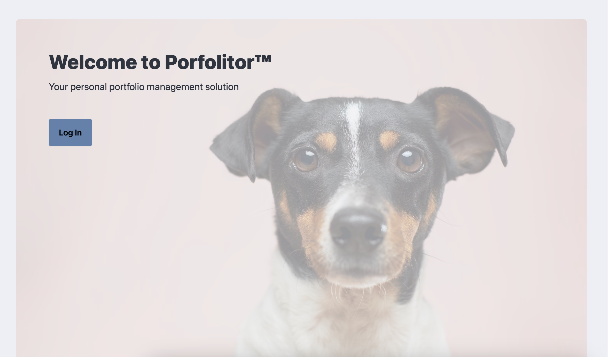

### Gallery

The app has an editor v. non-editor mode. The cards have conditionally-rendered icons.

Non-edtor mode allows the user to favour a project and display it in a prominent position at the top.

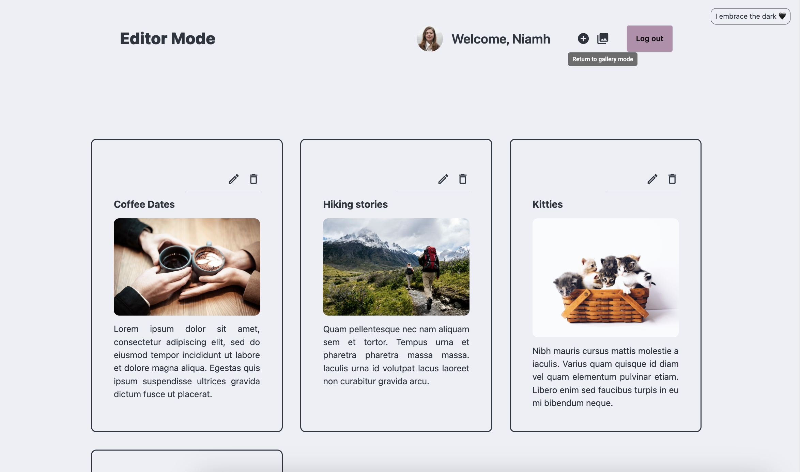

Edit mode allows the user to open the edit project screen and delete a project.

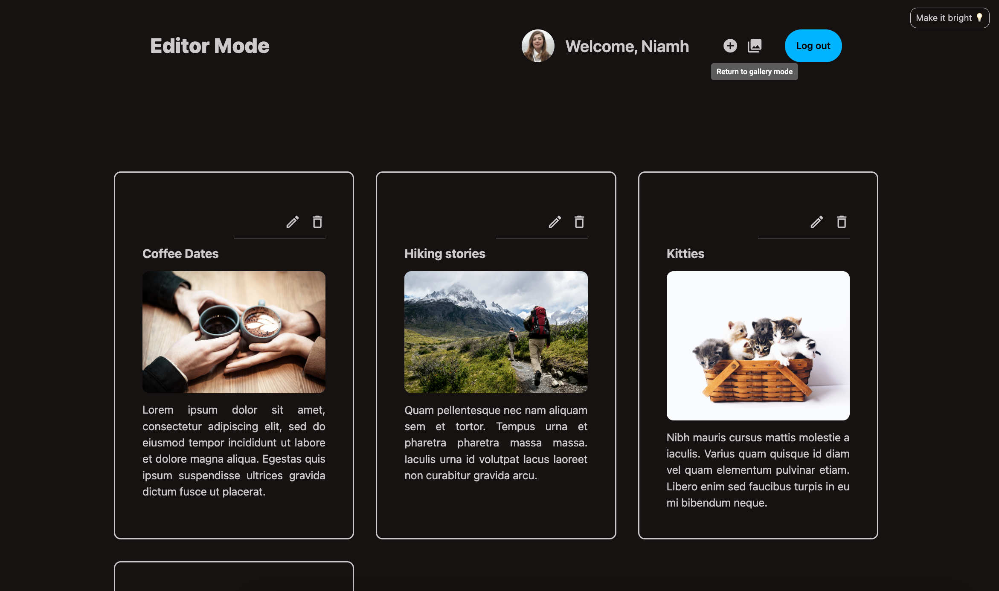

### Add new project view

Users can add a new project.

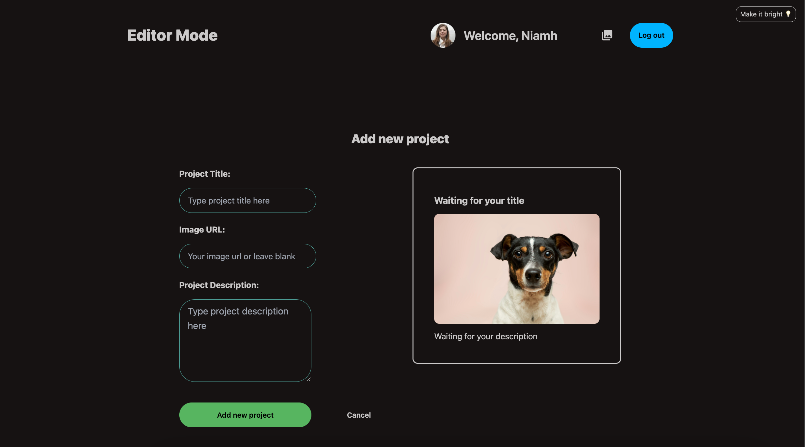

### Edit project view

Users can edit a project.

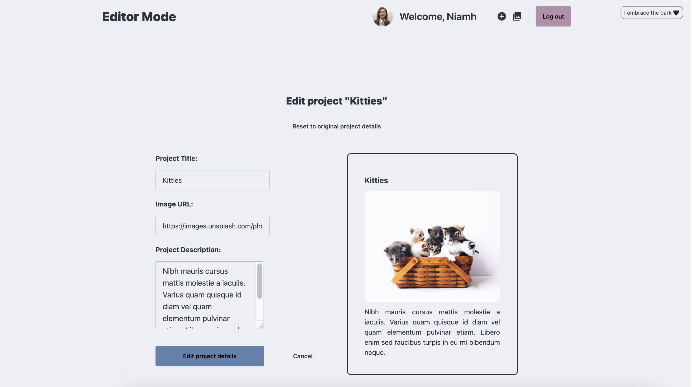

If the user makes a mistake while editing the "reset" button will restore the original project data.

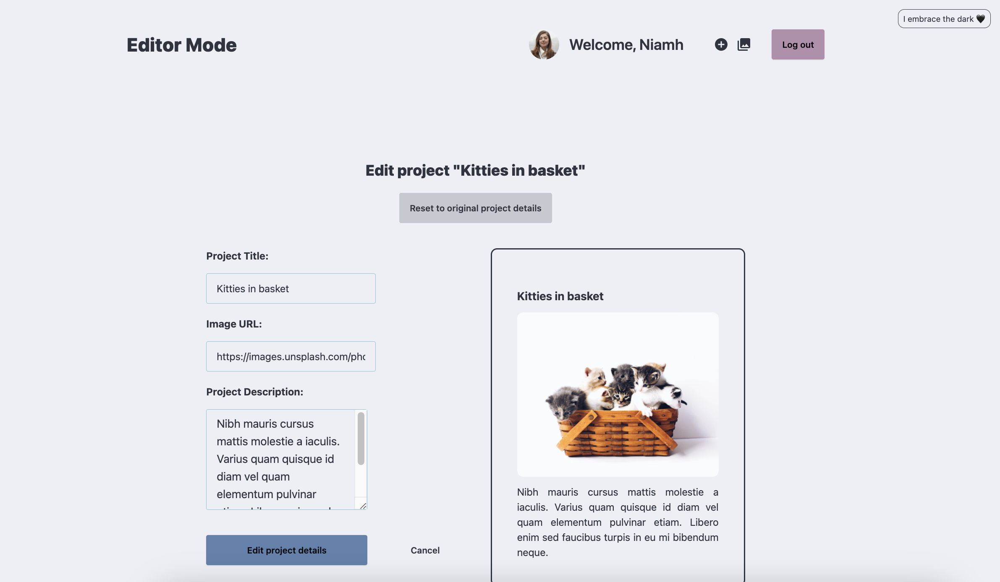

## Features

## Success modals

Add project modal

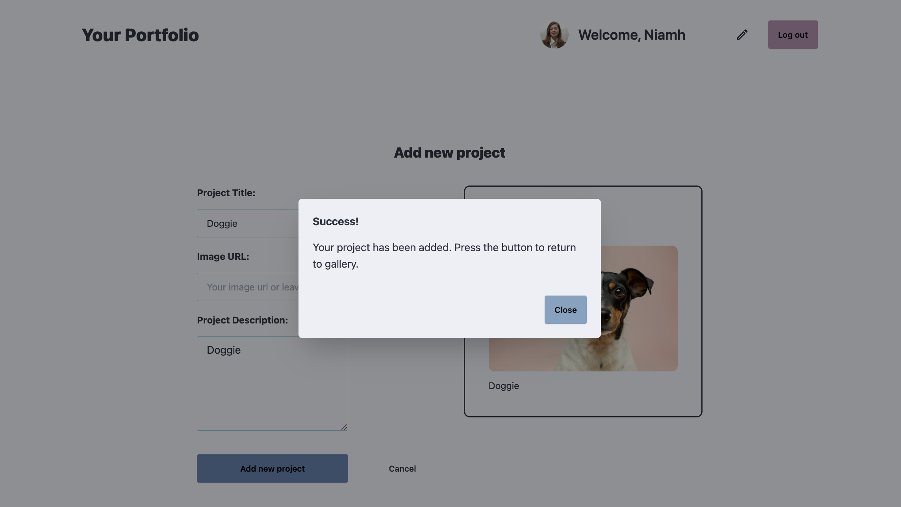

Edit project modal

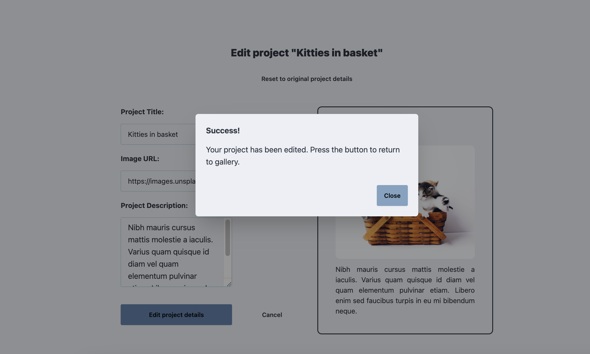

### Warning modal

A warning modal warns the user prior to destructive actions occuring (deletion of project).

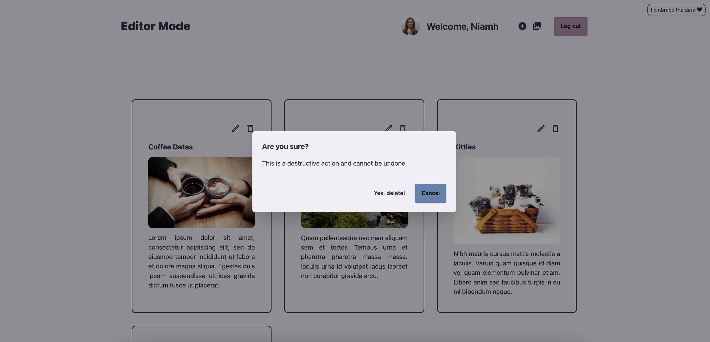

### Theme changer

There is light and dark mode.

### Fake API

Data is fetched from a fake API (localhost) using json server. On edit, add and delete the json data is updating, allowing the projects to persist between sessions.

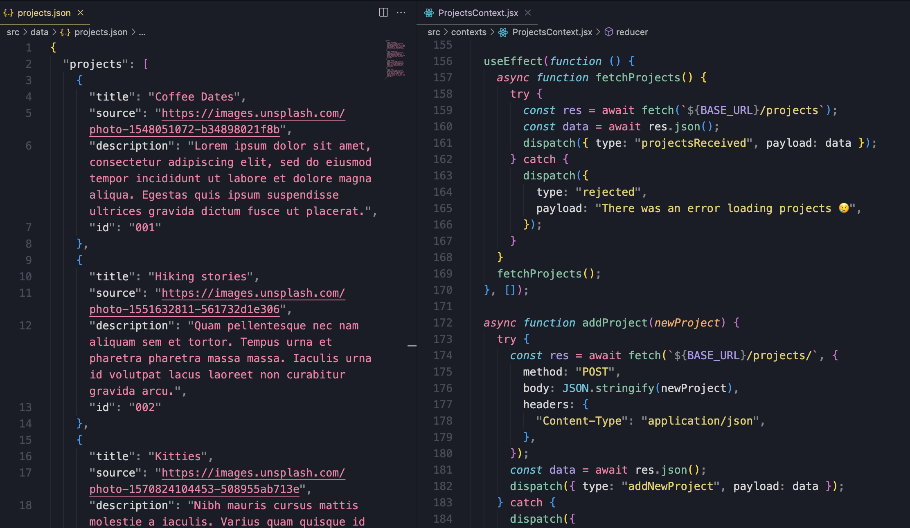

If the local server with the data isn't live the app renders an error message to the user.

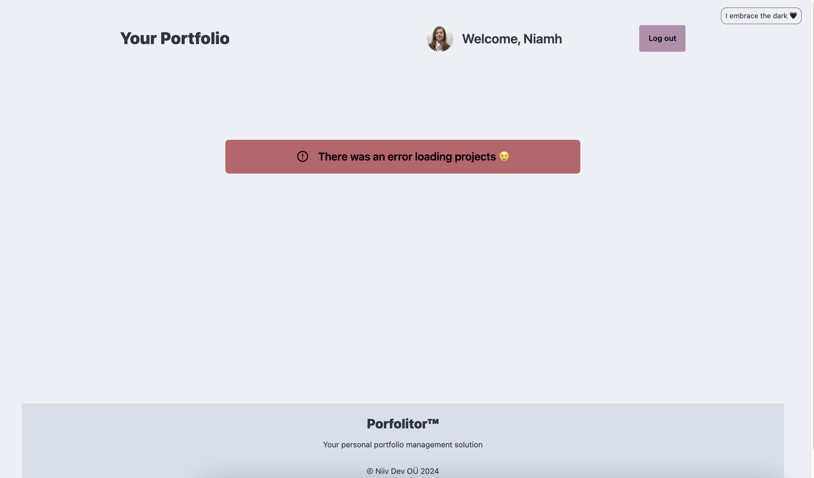

### Tooltips

The icons have tooltips

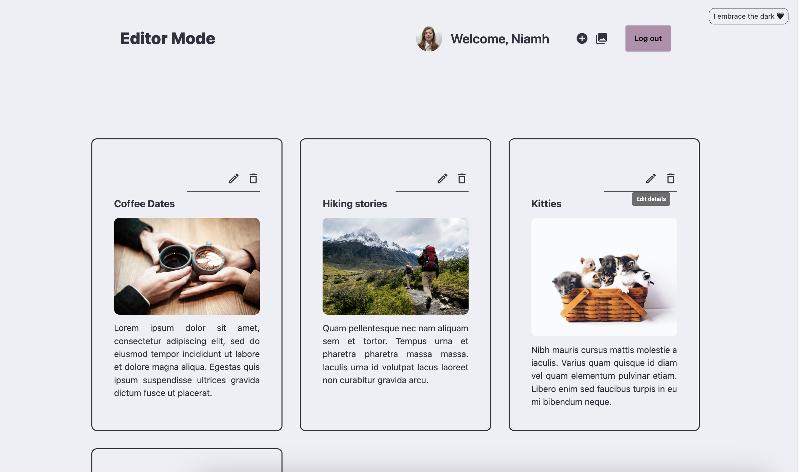
